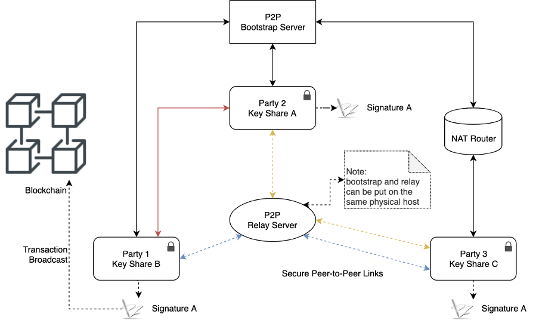

# User Guide of Threshold Signature Scheme \(TSS\) in Binance Chain

## Introduction

Binance TSS is based on P2P network framework, and can be deployed in WAN/LAN with centralized Bootstrap or Relay server or without\. In the first release of Binance TSS, It will support running in the LAN firstly\. 

TSS includes two major processes:

- n quorum participants can jointly create secret shares of private key through the Keygen CLI.
- Any t+1 of n required participants can sign the transactions using their secret shares through the Sign CLI

## Architecture

Below diagram demonstrate 1-3 deployment, i.e., 3 participants for the key gen and any 2 of these participants can do the signing, and one signature will be broadcast to the Binance Chain Successfully\.



Each party are the p2p peers, and setup up connection through the bootstrap process.

Each party has its own home directory to save the encrypted private key shares and p2p configs.

## Where can I download the Binance TSS CLI?

- You can download tss client from: [https://github.com/binance-chain/tss-binary](https://github.com/binance-chain/node-binary)
- You can download Binance Chain CLI release tbnbcli/bnbcli from: [https://github.com/binance-chain/node-binary](https://github.com/binance-chain/node-binary)

## How to Use

Basically, any one of n participants in the same LAN can initiate the keygen with the valut policy, i.e., t - n.

Any one of participants can invite other >t participants to join the signing.

Annotation Note

${\color{red}\textrm{Red text: user input}}$

${\color{grey}\textrm{Grey text: user password input, will be hidden}}$

Warning:

${\color{red}\textrm{
The secrets are generated in home directory, e.g., ./tss, and are stored in the encrypted keystore. The passphrase should be carefully maintained.}}$

```
./tss --help

Complete documentation is available at https://github.com/binance-chain/tss

Usage:
    tss [flags]

    tss [command]

Available Commands:

    channel         generate a channel id for bootstrapping

    describe        show config and address of a tss vault

    help            Help about any command

    init            create home directory of a new tss setup, generate p2p key pair

    keygen          key generation

    regroup         regroup a new set of parties and threshold

    sign            sign a transaction

Flags:

    -h, --help              help for tss

    --home string           Path to config/route_table/node_key/tss_key files, configs in config file can be overridden by command line arguments (default "~/.tss")
 
    --log_level string      log level (default "info")
 
    --password string       password, should only be used for testing. If empty, you will be prompted for password to save/load the secret/public share and config
 
    --vault_name string     name of vault of this party

Use "tss [command] --help" for more information about a command.
```

### Init (tss init)

Create home directory of a new tss setup, generate p2p key pair.

```
./tss init --help

create home directory of a new tss setup, generate p2p key pair

Usage:

    tss init [flags]

Flags:

    -h, --help                     help for init

    --kdf.iterations uint32    The number of iterations (or passes) over the memory. (default 13)

    --kdf.key_length uint32    Length of the generated key (or password hash). must be 32 bytes or more (default 48)

    --kdf.memory uint32        The amount of memory used by the algorithm (in kibibytes) (default 65536)

    --kdf.parallelism uint8    The number of threads (or lanes) used by the algorithm. (default 4)

    --kdf.salt_length uint32   Length of the random salt. 16 bytes is recommended for password hashing. (default 16)

    --moniker string           moniker of current party

    --p2p.listen string        Adds a multiaddress to the listen list

Global Flags:

    --home string         Path to config/route_table/node_key/tss_key files, configs in config file can be overridden by command line arg quments (default "~/.tss")

    --log_level string    log level (default "info")

    --password string     password, should only be used for testing. If empty, you will be prompted for password to save/load the secret/public share and config

    --vault_name string   name of vault of this party
```

Example:

||A|B|C|
|---|---|---|---|
|command|./tss init|./tss init|./tss init|
|Interactive input|> please set moniker of this party: <br> $\color{red}\textrm{tss1}$ <br> > please set vault of this party: <br> $\color{red}\textrm{vault1}$ <br> > please set password of this vault: <br> $\color{grey}\textrm{1234qwerasdf}$ <br> > please input again: <br> $\color{grey}\textrm{1234qwerasdf}$ | > please set moniker of this party: <br> $\color{red}\textrm{tss2}$ <br> > please set vault of this party: <br> $\color{red}\textrm{vault1}$ <br> > please set password of this vault: <br> $\color{grey}\textrm{asdfqwer1234}$ <br> > please input again: <br> $\color{grey}\textrm{asdfqwer1234}$ | > please set moniker of this party: <br> $\color{red}\textrm{tss3}$ <br> > please set vault of this party: <br> $\color{red}\textrm{vault1}$ <br> > please set password of this vault: <br> $\color{grey}\textrm{qwer1234asdf}$ <br> > please input again: <br> $\color{grey}\textrm{qwer1234asdf}$ |
|output | Local party has been initialized under: ~/.tss/vault1 | Local party has been initialized under: ~/.tss/vault1 | Local party has been initialized under: ~/.tss/vault1 |
|Files touched or generated|~/.tss/vault1/config.json <br> ~/.tss/vault1/node_key | ~/.tss/vault1/config.json <br> ~/.tss/vault1/node_key | ~/.tss/vault1/config.json <br> ~/.tss/vault1/node_key |

### Describe (./tss describe)

show config and address of a tss vault

```
show config and address of a tss vault

Usage:

    tss describe [flags]

Flags:

    --address_prefix string     prefix of bech32 address \(default "bnb"\)

    -h, --help                  help for describe

Global Flags:

    --home string         Path to config/route_table/node_key/tss_key files, configs in config file can be overridden by command line arg quments (default "~/.tss")

    --log_level string    log level (default "info")

    --password string     password, should only be used for testing. If empty, you will be prompted for password to save/load the secret/public share and config

    --vault_name string   name of vault of this party
```

Example:

||A|
|---|---|
|command|./tss describe|
|Interactive input|> please set vault of this party: <br> $\color{red}\textrm{default}$ <br> > Password to sign with this vault: <br> $\color{grey}\textrm{1234qwerasdf}$ |
|output|address of this vault: bnb1pjhqz6pfp7zre7xpj00rmr0ph276rmdsg8dcvm <br> config of this vault: <br> { <br> &emsp; "p2p": { <br> &emsp;&emsp; "listen": "/ip4/0.0.0.0/tcp/59968", <br> &emsp;&emsp;"bootstraps": null,<br> &emsp;&emsp;"relays": null,<br>&emsp;&emsp;"peer_addrs": [ <br> &emsp;&emsp;&emsp;"/ip4/127.0.0.1/tcp/59748",<br>&emsp;&emsp;&emsp;"/ip4/127.0.0.1/tcp/60022" <br> &emsp;&emsp;],<br>&emsp;&emsp;"peers": [ <br>&emsp;&emsp;&emsp;"test3@12D3KooWMmiUEXufJMFFp64hateKNaJ9kFTRLKgPhKeqBmX4dW8b",<br>&emsp;&emsp;&emsp;"test2@12D3KooWEUYdFC5nryMgYoLhUMN1Bq1M8uPaZv3RmBFakXsGx99K"<br>&emsp;&emsp;],<br>&emsp;&emsp;"DefaultBootstap": false<br>&emsp;},<br>&emsp;"Id": "12D3KooWQhF9WMDhFoHrZsSvL337FvwtM2VF9hHH6j5rnGVD8vgs",<br>&emsp;"Moniker": "tss1",<br>&emsp;"vault_name": "vault1",<br>&emsp;"Threshold": 1,<br>&emsp;"Parties": 3,<br>&emsp;"log_level": "info",<br>&emsp;"profile_addr": "",<br>&emsp;"Home": "~/.tss"<br>}|
|Files touched or generated|N/A|

### Generate bootstrap channel id (./tss channel):

```
./tss channel --help

generate a channel id for bootstrapping

Usage:

    tss channel [flags]

Flags:

    --channel_expire int    expire time in minutes of this channel

    -h, --help              help for channel

Global Flags:

    --home string           Path to config/route_table/node_key/tss_key files, configs in config file can be overridden by command line arguments (default "~/.tss")

    --log_level string      log level (default "info")

    --password string       password, should only be used for testing. If empty, you will be prompted for password to save/load the secret/public share and config

    --vault\_name string    name of vault of this party
```

Example:

||A|B|C|
|---|---|---|---|
|command|./tss channel|N/A|N/A|
|Interactive input| > please set expire time in minutes, (default: 30): <br> $\color{red}\textrm{[Enter]}$ | N/A | N/A |
| output | channel id: __3085D3EC76D__ | N/A | N/A |
| Files touched or generated | N/A | N/A | N/A |

### Keygen (tss keygen)

```
./tss keygen --help     

    generate secret share of t of n scheme

Usage:

    tss keygen [flags]

Flags:

    --address_prefix string     prefix of bech32 address (default "bnb")

    --channel_id string         channel id of this session

    --channel_password string   channel password of this session

    -h, --help                  help for keygen

    --p2p.peer_addrs strings    peer's multiple addresses

    --parties int               total parities of this scheme

    --threshold int             threshold of this scheme

Global Flags:

    --home string           Path to config/route_table/node_key/tss_key files, configs in config file can be overridden by command line arg quments (default "~/.tss")

    --log_level string      log level (default "info")

    --password string       password, should only be used for testing. If empty, you will be prompted for password to save/load the secret/public share and config

    --vault_name string     name of vault of this party
```

Example

||A|B|C|
|---|---|---|---|
|command|./tss keygen --vault_name vault1|./tss keygen --vault_name vault1|./tss keygen --vault_name vault1|
|Interactive input| > Password to sign with this vault: <br> $\color{grey}\textrm{1234qwerasdf}$ <br> > Do you like re-bootstrap again?[y/N]: <br> $\color{red}\textrm{[Enter]}$ <br> > please set total parties(n): <br> $\color{red}\textrm{3}$ <br> > please set threshold(t), at least t + 1 parties  need participant signing: <br> $\color{red}\textrm{1}$ <br> > please set channel id of this session <br> $\color{red}\textrm{3085D3EC76D}$ <br> please input password (AGREED offline with peers) of this session: <br> $\color{grey}\textrm{123456789}$ <br> Password of this tss vault: <br> $\color{grey}\textrm{1234qwerasdf}$ | > Password to sign with this vault: <br> $\color{grey}\textrm{asdfqwer1234}$ <br> > Do you like re-bootstrap again?[y/N]: <br> $\color{red}\textrm{[Enter]}$ <br> > please set total parties(n): <br> $\color{red}\textrm{3}$ <br> > please set threshold(t), at least t + 1 parties need participant signing: <br> $\color{red}\textrm{1}$ <br> > please set channel id of this session <br> $\color{red}\textrm{3085D3EC76D}$ <br> please input password (AGREED offline with peers) of this session: <br> $\color{grey}\textrm{123456789}$ <br> Password of this tss vault: <br> $\color{grey}\textrm{asdfqwer1234}$| > Password to sign with this vault: <br> $\color{grey}\textrm{qwer1234asdf}$ <br> > Do you like re-bootstrap again?[y/N]: <br> $\color{red}\textrm{[Enter]}$ <br> > please set total parties(n): <br> $\color{red}\textrm{3}$ <br> > please set threshold(t), at least t + 1 parties need participant signing: <br> $\color{red}\textrm{1}$ <br> > please set channel id of this session <br> $\color{red}\textrm{3085D3EC76D}$ <br> please input password (AGREED offline with peers) of this session: <br> $\color{grey}\textrm{123456789}$ <br> Password of this tss vault: <br> $\color{grey}\textrm{qwer1234asdf}$|
|output|18:00:09.777  INFO    tss-lib: party {0,tss1}: keygen finished! party.go:113 <br> 18:00:09.777  INFO        tss: [tss1] received save data client.go:304 <br> 18:00:09.777  INFO        tss: [tss1] bech32 address is: tbnb1mcn0tl9rtf03ke7g2a6nedqtrd470e8l8035jp client.go:309 <br> Password of this tss vault: <br> NAME:TYPE:ADDRESS:PUBKEY: <br> tss_tss1_vault1 tss tbnb19277gzv934ayctxeg5k9zdwnx3j48u6tydjv9p bnbp1addwnpepqwazk6d3f6e3f5rjev6z0ufqxk8znq8z89ax2tgnwmzreaq8nu7sx2u4jcc|18:00:09.777  INFO    tss-lib: party {1,tss2}: keygen finished! party.go:113 <br> 18:00:09.777  INFO        tss: [tss2] received save data client.go:304 <br> 18:00:09.777  INFO        tss: [tss2] bech32 address is: tbnb1mcn0tl9rtf03ke7g2a6nedqtrd470e8l8035jp client.go:309 <br> Password of this tss vault: <br> NAME:TYPE:ADDRESS:PUBKEY: <br> tss\tss2\vault1 tss tbnb19277gzv934ayctxeg5k9zdwnx3j48u6tydjv9p bnbp1addwnpepqwazk6d3f6e3f5rjev6z0ufqxk8znq8z89ax2tgnwmzreaq8nu7sx2u4jcc|18:00:09.773  INFO    tss-lib: party {2,tss3}: keygen finished! party.go:113 <br> 18:00:09.773  INFO        tss: [tss3] received save data client.go:304 <br> 18:00:09.773  INFO        tss: [tss3] bech32 address is: tbnb1mcn0tl9rtf03ke7g2a6nedqtrd470e8l8035jp client.go:309 <br> Password of this tss vault: <br> NAME:TYPE:ADDRESS:PUBKEY: <br> tss_tss3_vault1 tss tbnb19277gzv934ayctxeg5k9zdwnx3j48u6tydjv9p bnbp1addwnpepqwazk6d3f6e3f5rjev6z0ufqxk8znq8z89ax2tgnwmzreaq8nu7sx2u4jcc|
|Files touched or generated|~/.tss/vault1/pk.json <br> ~/.tss/vault1/sk.json <br> ~/.tss/vault1/config.json|~/.tss/vault1/pk.json <br> ~/.tss/vault1/sk.json <br> ~/.tss/vault1/config.json|~/.tss/vault1/pk.json <br> ~/.tss/vault1/sk.json <br> ~/.tss/vault1/config.json|

### Sign (with bnbcli)

The minimal required (t+1) participants can sign the transaction.

Example:

Table 1:

Generate a channel id and channel password, share face to face

||A|B|C
|---|---|---|---|
|command|./tss channel|N/A|N/A|
|Interactive input|N/A|N/A|N/A|
|output|channel id: __5185D3EF597__|N/A|N/A|

Table 2:

Sign with A and B

||A|B|C|
|---|---|---|---|
|command|tbnbcli send --amount 1000000:BNB --to tbnb1mh3w2kxmdmnvctt7t5nu7hhz9jnp422edqdw2d --from tss_tss1_vault1 --chain-id Binance-Chain-Nile --node https://data-seed-pre-0-s1.binance.org:443 --trust-node|tbnbcli send --amount 1000000:BNB --to tbnb1mh3w2kxmdmnvctt7t5nu7hhz9jnp422edqdw2d --from tss_tss2_vault1 --chain-id Binance-Chain-Nile --node https://data-seed-pre-0-s1.binance.org:443 --trust-node|NA|
|Interactive input|Password to sign with tss_tss1_vault1: <br> $\color{grey}\textrm{1234qwerasdf}$ <br> > Channel id: <br> $\color{red}\textrm{5185D3EF597}$ <br> please input password (AGREED offline with peers) of this session: <br> $\color{grey}\textrm{987654321}$ | Password to sign with tss_tss2_vault1: <br> $\color{grey}\textrm{asdfqwer1234}$ <br> > Channel id: <br> $\color{red}\textrm{5185D3EF597}$ <br> please input password (AGREED offline with peers) of this session: <br> $\color{grey}\textrm{987654321}$ | N/A | 
|output | Committed at block 33600477 (tx hash: 4FB8096A93D545612A3B5DCE520622608C299C7742103A6BE34C444829BD83A5) | ERROR: broadcast_tx_commit: Response error: RPC error -32603 - Internal error: Error on broadcastTxCommit: Tx already exists in cache | N/A |
|Files touched or generated|N/A|N/A|N/A|

Note:

1. Please make sure you didn’t change ./tss ./tbnbcli ./bnbcli file name and they are in same directory and all have “executable” linux file flag
2. Only one client will successfully broadcast the transaction (the first client in above table).

### Sign (without bnbcli)

The minimal required (t+1) participants can sign the transaction. Currently this subcommand used for signing a fake message (won’t broadcast transaction to blockchain). It can be used to check whether keygen result in working shares which can get the same signature in a sign session.

```
./tss sign --help

    sign a transaction using local share, signers will be prompted to fill in

Usage:

    tss sign [flags]

Flags:

    --channel_id string         channel id of this session

    --channel_password string   channel password of this session

    -h, --help                  help for sign

    --message string            message(in *big.Int.String() format) to be signed, only used in sign mode

Global Flags:

    --home string           Path to config/route_table/node_key/tss_key files, configs in config file can be overridden by command line arg quments (default "~/.tss")

    --log_level string      log level (default "info")

    --password string       password, should only be used for testing. If empty, you will be prompted for password to save/load the secret/public share and config

    --vault_name string     name of vault of this party
```

Example:

Table 1:

Generate a channel id and channel password, share face to face

||A|B|C|
|---|---|---|---|
|command|./tss channel|N/A|N/A|
|Interactive input|N/A|N/A|N/A|
|output|channel id: __5185D3EF597__|N/A|N/A|

Table 2:

Sign with A and B

||A|B|C|
|---|---|---|---|
|command|./tss sign|./tss sign|NA|
|Interactive input| > please set vault of this party: <br> $\color{grey}\textrm{1234qwerasdf}$ <br> > please set channel id of this session <br> $\color{red}\textrm{5185D3EF597}$ <br> > please input password (AGREED offline with peers) of this session: <br> $\color{red}\textrm{987654321}$ | > please set vault of this party: <br> $\color{grey}\textrm{asdfqwer1234}$ <br> > please set channel id of this session <br> $\color{red}\textrm{5185D3EF597}$ <br> > please input password (AGREED offline with peers) of this session: <br> $\color{grey}\textrm{987654321}$ | N/A |
| output | INFO    tss-lib: party {0,tss1}: sign finished! | INFO    tss-lib: party {1,tss2}: sign finished! | N/A |
| Files touched or generated | N/A | N/A | N/A |

### Regroup (TSS regroup)

```
./tss regroup --help

    generate new_n secrete share with new_t threshold. At least old_t + 1 should participant

Usage:

    tss regroup [Flags]

Flags:

    --channel_id string             channel id of this session

    --channel_password string       channel password of this session

    -h, --help                      help for regroup

    --is_new_member                 whether this party is new committee, for new party it will changed to true automatically. if an old party set this to true, its share will be replaced by one generated one

    --is_old                        whether this party is an old committee. If it is set to true, it will participant signing in regroup. There should be only t+1 parties set this to true for one regroup

    --new_parties int               new total parties of regrouped scheme

    --new_threshold int             new threshold of regrouped scheme

    --p2p.new_peer_addrs strings    unknown peer's multiple addresses

    --parties int                   total parities of this scheme

    --threshold int                 threshold of this scheme

Global Flags:

    --home string         Path to config/route_table/node_key/tss_key files, configs in config file can be overridden by command line arg quments (default "~\.tss")

    --log_level string    log level (default "info")

    --password string     password, should only be used for testing. If empty, you will be prompted for password to save/load the secret/public share and config

    --vault_name string   name of vault of this party
```

Example:

Refresh all parties secret share and configs (we recommend doing this periodically, say once a month)

Table1: preparation of regroup, generate a new channel id

||A|B|C|
|---|---|---|---|
|command|./tss channel|N/A|N/A|
|Interactive input|N/A|N/A|N/A|
|output|channel id: __3415D3FBE00__|N/A|N/A|

Table2: regroup

||A|B|C (doesn’t participant in signing)|
|---|---|---|---|
|command|./tss regroup|./tss regroup|./tss regroup|
|Interactive input| > please set vault of this party: <br> $\color{red}\textrm{vault1}$ <br> > Password to sign with this vault: <br> $\color{grey}\textrm{1234qwerasdf}$ <br> > Participant as an old committee? [Y/n]: <br> $\color{red}\textrm{Y}$ <br> > Participant as a new committee? [Y/n]: <br> $\color{red}\textrm{Y}$ <br> > please set new total parties(n): <br> $\color{red}\textrm{3}$ <br> > please set new threshold(t), at least t + 1 parties   participant signing: <br> $\color{red}\textrm{1}$ <br> > Channel id: <br> $\color{red}\textrm{3415D3FBE00}$ <br> please input password (AGREED offline with peers) of this session: <br> $\color{grey}\textrm{123456789}$ | > please set vault of this party: <br> $\color{red}\textrm{vault1}$ <br> > Password to sign with this vault: <br> $\color{grey}\textrm{asdfqwer1234}$ <br> > Participant as an old committee? [Y/n]: <br> $\color{red}\textrm{Y}$ <br> > Participant as a new committee? [Y/n]: <br> $\color{red}\textrm{Y}$ <br> > please set new total parties(n): <br> $\color{red}\textrm{3}$ <br> > please set new threshold(t), at least t + 1 parties need participant signing: <br> $\color{red}\textrm{1}$ <br> > Channel id: <br> $\color{red}\textrm{3415D3FBE00}$ <br> please input password (AGREED offline with peers) of this session: <br> $\color{grey}\textrm{123456789}$ | > please set vault of this party: <br> $\color{red}\textrm{vault1}$ <br> > Password to sign with this vault: <br> $\color{grey}\textrm{qwer1234asdf}$ <br> > Participant as an old committee? [Y/n]: <br> $\color{red}\textrm{n}$ <br> > Participant as a new committee? [Y/n]: <br> $\color{red}\textrm{Y}$ <br> > please set new total parties(n): <br> $\color{red}\textrm{3}$ <br> > please set new threshold(t), at least t + 1 parties needs participant signing: <br> $\color{red}\textrm{1}$ <br> > Channel id: <br> $\color{red}\textrm{3415D3FBE00}$ <br> please input password (AGREED offline with peers) of this session: <br> $\color{grey}\textrm{123456789}$|
|output|INFO        tss: [tss1] bech32 address is: tbnb1mcn0tl9rtf03ke7g2a6nedqtrd470e8l8035jp|INFO        tss: [tss2] bech32 address is: tbnb1mcn0tl9rtf03ke7g2a6nedqtrd470e8l8035jp|INFO        tss: [tss3] bech32 address is: tbnb1mcn0tl9rtf03ke7g2a6nedqtrd470e8l8035jp|
|Files touched or generated|~/.tss/vault1/config.json <br> ~/.tss/vault1/pk.json <br> ~/.tss/vault1/sk.json <br> ~/.tss/vault1/node_key | ~/.tss/vault1/config.json <br> ~/.tss/vault1/pk.json <br> ~/.tss/vault1/sk.json <br> ~/.tss/vault1/node_key | ~/.tss/vault1/config.json <br> ~/.tss/vault1/pk.json <br> ~/.tss/vault1/sk.json <br> ~/.tss/vault1/node_key |

New committee having different t-n from old committee

1. Change 1-3 into 2-4 scheme
2. Old parties (A, B) join new committee
3. New parties (D, E) are newly-joined

Table 1:

Init profiles for 2 new parties (D and E)

||D|E|
|---|---|---|
|command|./tss init  --vault_name vault1|./tss init  --vault_name vault1|
|Interactive input| > please set moniker of this party: <br> $\color{red}\textrm{tss4}$ <br> > please set password for key share: <br> $\color{grey}\textrm{7890uiopjkl;}$ <br> > please intput again: <br> $\color{grey}\textrm{7890uiopjkl}$ | > please set moniker of this party: <br> $\color{red}\textrm{tss5}$ <br> > please set password for key share: <br> $\color{grey}\textrm{uiopjkl;7890}$ <br> > please input again: <br> $\color{grey}\textrm{uiopjkl;7890}$ |
|output|Local party has been initialized under: ~/.tss/vault1 | Local party has been initialized under: ~/.tss/vault1 |

Table 2:

Regroup from 1-3 to 2-4, with 2 old parties (A and B) and 2 new parties (D and E)

||A (old&new committee)|B (old&new committee)|D (new committee)|E (new committee)|
|---|---|---|---|---|
|command|./tss regroup/ --vault_name vault1 | ./tss regroup  --vault_name vault1 | ./tss regroup  --vault_name vault1 | ./tss regroup  --vault_name vault1|
|Interactive input| > please input password: <br> $\color{grey}\textrm{1234qwerasdf}$ <br> > Participant as an old committee? [Y/n]: <br> $\color{red}\textrm{Y}$ <br> > Participant as a new commitee? [Y/n]: <br> $\color{red}\textrm{Y}$ <br> > please set NEW total parties(n): <br> $\color{red}\textrm{4}$ <br> > please set NEW threshold(t), at least t + 1 parties participant signing: <br> $\color{red}\textrm{2}$ <br> > Channel id: <br> $\color{red}\textrm{3415D3FBE00}$ <br> > please input password (AGREED offline with peers) of this session: <br> $\color{grey}\textrm{123456789}$ | > please input password: <br> $\color{grey}\textrm{asdfqwer1234}$ <br> > Participant as an old committee? [Y/n]: <br> $\color{red}\textrm{Y}$ <br> > Participant as a new committee? [Y/n]: $\color{red}\textrm{Y}$ <br> > please set NEW total parties(n): <br> $\color{red}\textrm{4}$ <br> > please set NEW threshold(t), at least t + 1 parties need participant signing: <br> $\color{red}\textrm{2}$ <br> > Channel id: <br> $\color{red}\textrm{3415D3FBE00}$ <br> > please input password (AGREED offline with peers) of this session: <br> $\color{grey}\textrm{123456789}$ | > please input password: <br> $\color{grey}\textrm{7890uiopjkl;}$ <br> > please set Old total parties(n): <br> $\color{red}\textrm{3}$ <br> > please set Old threshold(t), at least t + 1 parties need participant signing: <br> $\color{red}\textrm{1}$ <br> > please set NEW total parties(n): <br> $\color{red}\textrm{4}$ <br> > please set NEW threshold(t), at least t + 1 parties need participant signing: <br> $\color{red}\textrm{2}$ <br> > Channel id: <br> $\color{red}\textrm{3415D3FBE00}$ <br> > please input password (AGREED offline with peers) of this session: <br> $\color{grey}\textrm{123456789}$ | > please input password: <br> $\color{grey}\textrm{uiopjkl;7890}$ <br> > please set Old total parties(n): <br> $\color{red}\textrm{3}$ <br> > please set Old threshold(t), at least t + 1 parties need participant signing: <br> $\color{red}\textrm{1}$ <br> > please set NEW total parties(n): <br> $\color{red}\textrm{4}$ <br> > please set NEW threshold(t), at least t + 1 parties need participant signing: <br> $\color{red}\textrm{2}$ <br> > Channel id: <br> $\color{red}\textrm{3415D3FBE00}$ <br> > please input password (AGREED offline with peers) of this session: <br> $\color{grey}\textrm{123456789}$ |
|output|||||
|Files touched or generated| ~/.tss/vault1/config.json <br> ~/.tss/vault1/pk.json <br> ~/.tss/vault1/sk.json | ~/.tss/vault1/config.json <br> ~/.tss/vault1/pk.json <br> ~/.tss/vault1/sk.json | ~/.tss/vault1/config.json <br> ~/.tss/vault1/pk.json <br> ~/.tss/vault1/sk.json | ~/.tss/payment/config.json <br> ~/.tss/payment/pk.json <br> ~/.tss/vault1/sk.json |

## Security Guideline

### Vault Policy Guideline

- Your quorum groups should have more participants than the required minimum number for approval. This setup allows replacing a participant or restoring one participant. For example, your group has 2 participants required for signing, and it has 3 participants. A participant loses his shared key, and the remaining 2 can reactivate the participant by regroup process.
- Validate the correctness of keygen: sign several small transactions using different combinations of different parties to ensure the correctness of the encrypted shares. Only after the validation is done, transfer funds to this address.
- To avoid any potential leakage, regularly regroup (e.g., monthly) are recommended\.
- After the regroup, the existing key shares including backup should be removed permanently.

### Shared Key Backup and Restore

- The encrypted file with shared keys should be stored in a very secured place and backup (remember to delete the old backup after regroup) as well.
- Creating some participants only for key regeneration and regroup. Their secret shares should be safely stored offline, e.g., no internet access.

Offline insurance:

- Monikers should be distinct
- Channel password should be discussed each time a new session (keygen, sign, regroup) is going to be established
- No other tss process (with same channel) is running at the same time one vault is running
- Keygen command will add a key with name "tss_\<moniker\>_\<vault_name\>" to computer’s default bnbcli home (~/.bnbcli), it will override existing one without confirmation, please make sure you don’t have key with the same name.

## Troubleshooting

TBD
